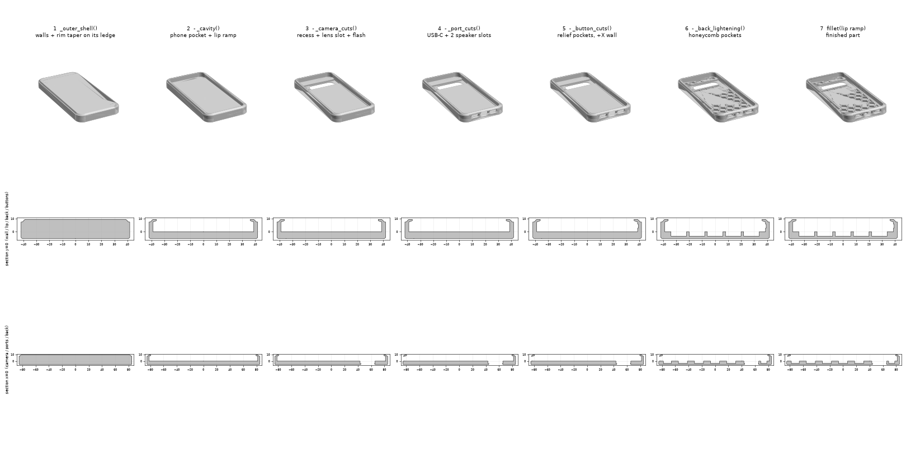
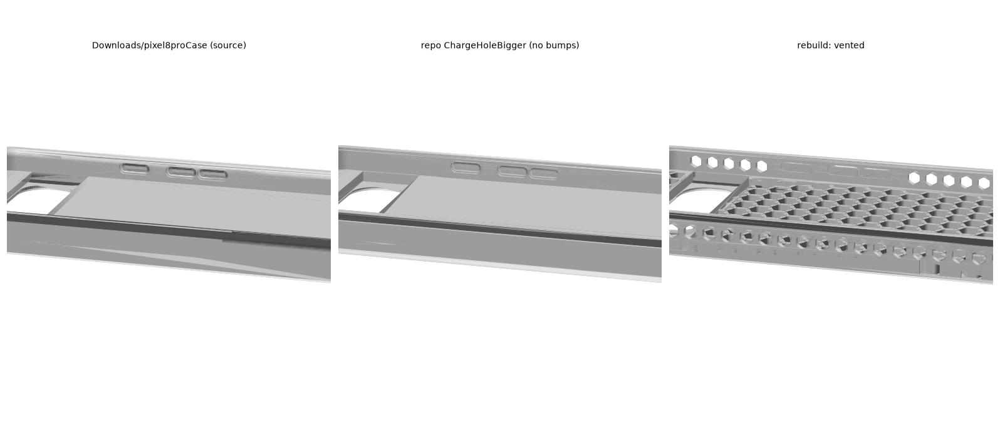
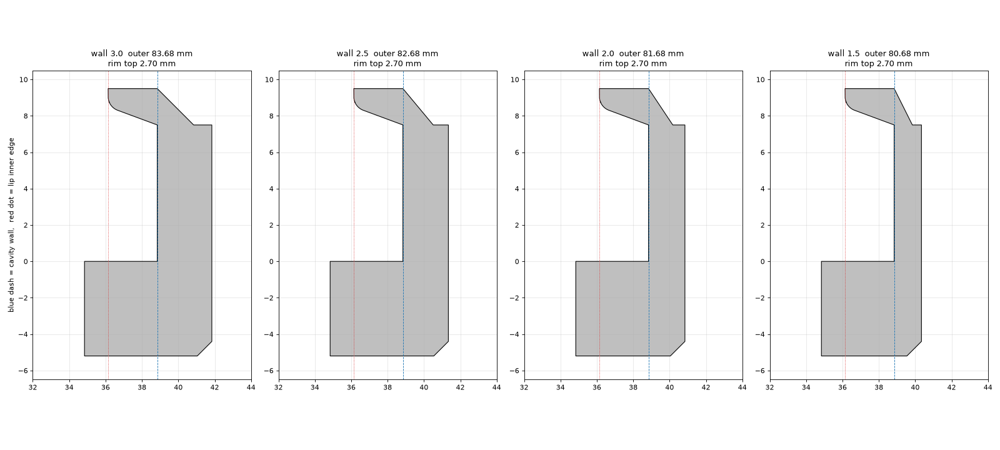
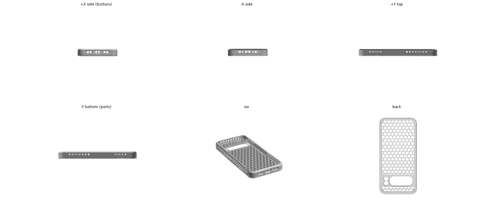

# Design notes

How the model is built, what was measured off the source files, and why each
value is what it is. For printing and preset selection see the
[README](README.md).

Every dimension in `Params` was measured from the source meshes rather than
eyeballed. `verify.py` samples the rebuilt surface and reports its distance
back to the original.

**Only the default configuration has been printed and tested.** The
comparisons below are measurements taken while arriving at it — they record
why each value is what it is, and the limits found along the way. Where a
figure was measured at a configuration other than the shipped one, that is
stated.

## Contents

- [How it is built](#how-it-is-built)
- [Coordinate system](#coordinate-system)
- [The two source STLs](#the-two-source-stls)
- [What the original actually is](#what-the-original-actually-is)
- [Defects found and fixed](#defects-found-and-fixed)
- [Camera and back thickness](#camera-and-back-thickness)
- [Charging port](#charging-port)
- [Buttons](#buttons)
- [Back styles](#back-styles)
- [Side walls](#side-walls)
- [Side wall vents](#side-wall-vents)
- [The top edge](#the-top-edge)
- [The back edge](#the-back-edge)
- [Where the mass is](#where-the-mass-is)
- [Verification](#verification)

## How it is built



`build_case()` runs seven steps: the outer shell (walls plus the tapered rim on
its ledge), then the cavity and lip, the camera recess and its openings, the
ports, the button relief, the back lightening, and finally a fillet on the lip
ramp. Only step six differs between back styles. The lower rows are sections at
y = 0 and x = 0 so the profile can be followed as it develops.

## Coordinate system

Origin at the centre of the case in X/Y, **Z = 0 at the cavity floor** (where
the phone's back rests). `+Z` points out of the opening, `+Y` towards the
camera bar, `+X` towards the buttons. `export()` drops the part onto Z = 0 so
the STL is ready to slice back-down. The source meshes are translated off
origin by (1.3416, −1.7775); this one is centred.

## The two source STLs

`pixel8CaseChargeHoleBigger.stl` is **not** the Printables model with a bigger
charging port. It is a thickened derivative:

| | `pixel8proCase.stl` | `pixel8CaseChargeHoleBigger.stl` |
|---|---|---|
| Outer | 82.14 × 167.21 × 14.00 | 83.68 × 169.76 × 14.70 |
| Volume | 62.1 cm³ | 75.2 cm³ |
| Side wall | 1.729 mm | 3.000 mm |
| Back | 4.5 mm | 5.2 mm |
| Button bumps | **yes, 1.00 mm proud** | **none** |
| Corner geometry | clean | 1 mm step at all four corners |
| USB-C aperture | 12.65 × 4.68 mm | 15.05 × 7.08 mm |
| Cavity | identical | identical |

Both share the same centre (1.3416, −1.7775) and the same corner-arc rails
(±28.842, ±71.878), and their cavities are identical — so the phone fit is the
same in both. The difference is entirely the outer shell, offset outward by
~1.27 mm per side.

**That offset is what removed the button bumps**: the wall grew 1.271 mm while
the bumps stood only 1.000 mm proud, so it swallowed them. The same operation
produced the corner step, by offsetting a rounded rectangle without keeping the
arcs tangent to the straight runs.

`case.py` reproduces both. Against `pixel8proCase.stl`,
`wall=1.729, cam_recess=2.5, cam_skin=2.0` gives an identical bounding box and
0.046 mm mean deviation — a useful independent check, since those parameters
were derived from the *other* file.

## What the original actually is

Measured off `pixel8CaseChargeHoleBigger.stl`:

| Feature | Measured |
|---|---|
| Outer | 83.68 × 169.76 × 14.70 mm, corner R13.0 |
| Phone cavity | 77.68 × 163.76 × 9.50 mm, corner R10.0 |
| Clearance vs 76.5 × 162.6 × 8.8 | 0.59/side XY, 0.70 Z |
| Side walls | 3.0 mm |
| Back | **5.2 mm solid** — flat-back design, filled to camera-bar height |
| Camera skin | 1.5 mm, over a 76.28 × 22.30 × 3.7 mm recess |
| Lip | 2.70 mm past the cavity wall (≈2.11 mm over the phone face) |
| Ports | USB-C 15.05 × 7.08, two speaker slots 14.34 × 4.68 |
| Buttons | inner relief pockets only, no through-holes |
| Volume | 75.2 cm³ ≈ 91 g TPU |

## Defects found and fixed

1. **End walls were 2.0 mm, not 3.0 mm.** The straight top and bottom outer
   edges sat 1.0 mm inboard of where the corner arcs are tangent, leaving an
   abrupt 1 mm step at all four corners — a stress riser exactly where drop
   impacts land, on the thinnest walls in the part. Now a proper tangent
   rounded rectangle, 3.0 mm all round.
2. **Back-edge chamfer was on two sides only** — 3.2 mm at 45° on −X and −Y,
   square on +X and +Y. Now a symmetric **2.5 mm break all round**, and a
   softer one: `back_edge_style="soft"` (default) is the 45° chamfer with its
   top edge blended into the wall on R1.5 (`back_edge_blend`), so the hand
   meets a round rather than a line, while the surface leaving the bed is
   still 45° and prints unsupported. See
   [The back edge](#the-back-edge).
3. **The flash cutout contained an unprintable sliver** — see
   [Camera](#camera-and-back-thickness).
4. **Sharp-cornered camera recess** — now R1.0.
5. **Exact-stadium port slots** meshed with a seam that reads as a hole in some
   slicers. `_rrect()` now holds the radius clear of `w/2` and `h/2`; an exact
   stadium leaves zero-length straight segments that OCCT tessellates badly.

## Camera and back thickness

`back_thk` is **derived, not free**: the back is exactly as thick as the recess
the camera bar drops into, plus the skin over it.

```
back_thk = cam_recess + cam_skin
```

The Pixel 8 Pro's camera bar measures **2.5 mm on the phone**, which is also
exactly what the stock case uses — confirmed from both ends. The thickened file
instead used a 3.7 mm recess and took the difference out of the skin, so it was
0.7 mm *thicker* overall while giving 0.5 mm *less* protection over the lenses:

| | Recess | Skin over bar | `back_thk` | Case height |
|---|---|---|---|---|
| `pixel8proCase.stl` (stock) | 2.500 | 2.000 | 4.5 | 14.00 |
| `pixel8CaseChargeHoleBigger.stl` | 3.700 | 1.500 | 5.2 | 14.70 |
| presets here | 2.500 | **1.000** | 3.5 | **13.00** |

At `cam_skin = 1.0` the lens openings become a 0.5 mm straight bore plus a
0.5 mm chamfer (`cam_straight` is clamped to half the skin so it can never
exceed it). 1.0 mm is five layers at 0.2 mm of unsupported TPU directly over
the lens glass — this is the floor, not a value with headroom in it.

Because the honeycomb cells are `back_thk` tall, shortening the back takes mass
out of the whole lattice, not just at the camera. It is worth more than any
other single change here.

### Flash opening

The source models put the flash and the temperature sensor in two circles whose
centres are 9.503 mm apart with radii summing to 9.294 — leaving a **0.209 mm
ligament** between them, 0.5 mm tall, which the chamfer below merges away
0.104 mm further down. It is a floating flake no nozzle can produce.

`flash_stadium=True` (default) replaces the pair with one stadium of
9.294 × 18.797 mm, r = 4.647 — the exact same outer envelope, one clean
opening. `original` keeps the two circles, since it reproduces the source file.

## Charging port

The stock case's USB-C opening does not clear a real cable. Measured at its
narrowest point (it is chamfered from both faces, so the waist is mid-wall):

| | Narrowest aperture | Wall |
|---|---|---|
| `pixel8proCase.stl` (stock) | **12.65 × 4.68 mm** | 1.729 mm |
| `pixel8CaseChargeHoleBigger.stl` | **15.05 × 7.08 mm** | 3.000 mm |
| every preset here | **15.05 × 7.08 mm** | 1.5–3.0 mm |

**Height is the blocker, not width.** A USB-C tongue is only 2.4 mm tall, but
the moulded housing around it is typically 5–7 mm — so 12.65 mm of width was
never the problem, and 4.68 mm of height was.

If a particularly fat cable still fouls, **widen rather than heighten**:

- **Height is essentially maxed out.** The hole spans z 0.30…7.38 of the
  0…7.50 available between the cavity floor and the wall top. Taller breaks
  into the lip above or the back below.
- **Width has room.** The USB opening ends at x = 7.60 and the speaker slot
  starts at x = 10.58 — 2.98 mm of material each side. `usb_w` could go to
  roughly 19 mm before the ribs get too thin to print.

### Port bars

Each opening's ceiling is a flat run that has to be bridged. The stadium's flat
top is `w − h` long: 7.97 mm for USB-C, 9.66 mm for a speaker slot.

`spk_bars` (default 2) puts permanent 1.0 mm ribs back across each speaker
slot, cutting its bridge to three 2.55 mm segments. Nothing passes through a
speaker slot, so there is nothing to remove — it is just a grille.

`usb_bar` puts a 0.8 mm bar across the USB opening, halving that bridge to
2 × 3.59 mm. It stands in the plug's way and **must be snipped out**.

Note that augura reports these ceilings as a "0.8 mm span" and still says they
need support. That figure is the face's *minor* dimension — the straight-bore
depth in Y — and Y is open at both ends, so there is nothing to anchor across
it. The direction that actually gets bridged is X, anchored on the solid wall
either side, and that is the `w − h` figure above.

## Buttons



*Left: the stock file, with bumps. Centre: the thickened file, where the offset
swallowed them. Right: the rebuild.*

### Relief pockets

The pockets in the inner face of the +X wall are **clearance for the buttons**,
which stand proud of the phone's frame. Without them the wall rests on the
button and holds it part-pressed. They are not there to thin the wall for flex,
and they cannot be dropped to buy wall thickness.

What the button sees is `clr_xy + btn_depth`, not `btn_depth` alone:

| | Wall | Relief | Behind buttons | Gap at the button |
|---|---|---|---|---|
| `pixel8proCase.stl` (stock) | 1.729 | 0.229 | 1.500 | **0.821 mm** |
| `pixel8CaseChargeHoleBigger.stl` | 3.000 | 0.500 | 2.500 | **1.092 mm** |

The stock case's 0.821 mm is known to work in practice, so `wall = 1.5` with
`btn_depth = 0.229` reproduces that gap exactly while leaving 1.271 mm of
material behind the button. `vented` uses this.

### Bumps

`button_bumps=True` (default) puts raised press pads on the outside of the +X
wall. Measured off `pixel8proCase.stl` and reproduced to **0.011 mm** through
the whole profile:

| | Value |
|---|---|
| Proud of wall | 1.00 mm |
| Plateau (y × z) | 8.75 × 1.47 mm |
| Plateau centre height | z = 4.27 |
| Edges | 45° chamfer all round |
| Spans (y) | −9.25…−0.50, 2.75…11.50, 20.75…29.50 |

Three pads — volume down, volume up, power. The 45° lower chamfer is what makes
them printable back-down; a square pad would leave a horizontal overhang.
`side_vents` knows about them and keeps clear. `original` sets
`button_bumps=False`, since the STL it reproduces does not have them.

## Back styles

Set via `Params.back_style`.

| Style | Volume | ≈ TPU | Notes |
|---|---|---|---|
| `flat` | 56.5 cm³ | 68 g | solid back, as the source |
| `honeycomb` | 45.2 cm³ | 55 g | default |
| `ribbed` | 45.7 cm³ | 55 g | square grid |
| `bump` | 36.7 cm³ | 44 g | lightest, but needs support |

`honeycomb` and `ribbed` void the back slab **from the cavity side**, leaving a
1.8 mm skin against the outer face. The outer back stays flat and smooth; the
phone rests on the rib tops at Z = 0. Because every pocket opens upwards, both
print back-down with no support and no bridging — measurably *less* overhang
than the solid version. They also vent the cavity, so the phone no longer
suctions in and out.

`bump` is the conventional thin-back-plus-camera-plateau design. It is the
lightest but its back skin overhangs the plateau, so it needs support in any
orientation (33.9 % of its surface, against ~3 % for the others).

### Why honeycomb over the square grid

Both come out at roughly the same mass, but the hex pattern is better on two
counts:

- **Less wall for the same cell area.** Hexagonal cells meet three-way at 120°,
  the minimum-length way to partition a plane into equal cells. For cell area
  *A* a honeycomb needs 1.861·√A of wall per cell against 2·√A for squares —
  7 % less. Measured on the actual field: 60 hex cells open 6614 mm² where 36
  square cells open 6330 mm².
- **No hinge lines.** The square grid runs continuous straight ribs the whole
  length of the case, and a TPU case will preferentially fold along them. No
  straight line crosses a honeycomb field, so it stiffens isotropically.

`hex_pitch` is the cell centre spacing, and the wall left between neighbours is
exactly `rib_w` (14.0 pitch − 2 × 6.0 inradius = 2.000 mm). Cells are
pointy-top. Boundary cells below `pocket_min_frac` of a full cell are dropped
rather than left as slivers.

### Open cells

`pocket_through=True` cuts the cells clean through the back instead of stopping
at the skin. The phone shows through and the back becomes a pure lattice: about
20 % lighter again, no overhang added (the holes are vertical prisms), and less
material between the phone and a Qi coil.

The cost is real: **no material behind the phone's back glass.** Dropped on
gravel, something can reach the glass through a cell. The skin was also doing
plate work — without it the back is a 2D lattice and noticeably floppier.

If that matters, spend the grams on *smaller cells* rather than thicker walls.
The same mass buys a much smaller opening (measured at `back_thk` 5.2):

| Settings | Hole across flats | Cells | Volume | Hole perimeter |
|---|---|---|---|---|
| `hex_pitch` 14, `rib_w` 2.0 | 12.0 mm | 60 | 43.2 cm³ | 2352 mm |
| `hex_pitch` 14, `rib_w` 3.0 | 11.0 mm | 60 | 48.5 cm³ | — |
| `hex_pitch` 10, `rib_w` 2.0 | 8.0 mm | 116 | 48.8 cm³ | 2982 mm |
| **`hex_pitch` 8, `rib_w` 1.5** | **6.5 mm** | 161 | 48.7 cm³ | 3466 mm |

The last three weigh the same to within 0.3 cm³ but leave an 11.0, 8.0 or
6.5 mm opening, so the finest is the clear win. Walls stay exactly at `rib_w`
everywhere — eroding the lattice section by 0.75 mm/side breaks it into 227
pieces at `rib_w` 1.5, precisely half the nominal, so the boundary trim leaves
no thin ligaments. The 1 mm corner fillet costs only 1 % of cell area, so the
cells are still true hexagons.

The catch at fine pitch is **print time, not material**: hole perimeter rises
faster than volume falls. `hex_pitch` 8 traces 47 % more wall than `hex_pitch`
14 through the full depth.

### The cell edges

`cell_chamfer` breaks the bed-side edge of every cell — the lattice is the face
you see and touch on the back of the case, and unbroken it is 190 sharp
hexagons. 45°, not a round, for the same reason as the back edge: printed
back-down these are first-layer edges, and a fillet is tangent to the bed, so
each layer would step into the cell with nothing under it. A 45° flare advances
exactly one layer height per layer.

It is paid for out of the first layer — each cell wall loses twice the break,
and so does the frame where cells meet it:

| `cell_chamfer` | Cell wall at the bed | First layer | Frame at the bed |
|---|---|---|---|
| 0 | 1.50 mm | 4684 mm² | 1.52 mm |
| 0.30 | 0.90 mm | 3512 mm² | 1.24 mm |
| **0.40** | **0.70 mm** | **3071 mm²** | **1.14 mm** |
| 0.50 | 0.50 mm | 2617 mm² | 1.04 mm |

0.40 is shipped. The first layer is one connected island at every value in that
table — what matters for a lattice is that no cell is left printing on its own
— and 0.70 mm walls print as a pair of thin perimeters. 0.50 would leave a
single 0.50 mm extrusion holding each cell down, which is where this stops
being safe. Above the break the walls are the full `rib_w` 1.50 mm, so none of
this touches the lattice's stiffness; it is paid entirely in bed adhesion.

## Side walls

`wall` sets the outer size directly, since `out_w = cav_w + 2·wall`. Thinning
it is the only change that makes the case *smaller* as well as lighter. Three
thicknesses are derived from it, and they bind before the wall itself does:

| `wall` | Outer W × L | Rim top | Behind buttons | Port bore |
|---|---|---|---|---|
| 3.0 | 83.68 × 169.78 | 2.70 | 2.50 | 2.00 |
| 2.5 | 82.68 × 168.78 | 2.70 | 2.00 | 1.50 |
| 2.0 | 81.68 × 167.78 | 2.70 | 1.50 | 1.00 |
| **1.5** | **80.68 × 166.78** | 2.70 | 1.27 | 0.75 |
| 1.2 | 80.08 × 166.18 | 2.70 | 0.97 | 0.60 |



*The rim top stays 2.70 mm wide at every wall thickness, because
`rim_ledge` and `rim_taper` are fractions of `wall`. Blue dash marks the cavity
wall, red dot the lip inner edge. Drawn with the original's ledge-and-taper
rim; see [The top edge](#the-top-edge) for the profile actually shipped.*

*(behind-buttons at `btn_depth` 0.229; at the 0.5 default subtract a further
0.27)*

1.5 mm is the floor. The wall is then already thinner than the stock case's
1.729, and the button clearance still has to come out of it.

Two couplings had to be fixed before thin walls behaved:

- **The rim scaled wrong.** `rim_ledge` and `rim_taper` were absolute (1.0 and
  2.0 mm), and their sum is exactly the original's 3.0 mm wall — which is why
  the original's rim top lands precisely on the cavity wall. Held absolute,
  they ate past the lip as the wall thinned. They are now fractions of `wall`
  summing to 1, so the rim top stays exactly `lip_inset` wide — 2.70 mm at
  every row above, instead of collapsing to 0.90 mm at `wall` 1.2.
- **The port chamfer could eat the whole wall.** `port_chamfer` is 1.0 mm, so
  at `wall` 1.0 there was no straight bore left and the port became a pure
  funnel. It is now clamped to `wall/2`.

Reducing `wall` costs edge drop protection, and thin TPU walls stretch more —
easier to fit, but also easier for the phone to leave the case on impact.
`lip_inset` is measured from the cavity, so the lip's grip is unaffected.

## Side wall vents

`side_vents=True` cuts hexagons through the side walls. Placement is automatic
and skips what it must:

| Wall | Vents | Skipped |
|---|---|---|
| −X (long) | 21 | — |
| +X (long) | 13 | button relief pockets, y −13.7…34.2 |
| +Y (top) | 8 | — |
| −Y (bottom) | 0 | USB-C and both speaker slots fill it entirely |



42 vents, confirmed by the genus rising by exactly 42 when they are enabled.
Corners are always left solid — they take the drops.

Cells are vertex-up. Note that the top edges of a vertex-up hexagon sit at
exactly 30° from horizontal, so a strict 45° support rule flags them; over the
~1.3 mm rise here, converging to a point, TPU handles it. `rotation=0` in
`_side_vents` gives a flat-top cell if you want it strictly compliant — a short
horizontal bridge flanked by self-supporting 60° edges.

Vents are the smallest of the three weight levers, because the perforable band
is only the side wall below the lip; the rim and lip above it have to stay.

## The top edge

Where the run from wall to rim top is spent is free — only `rim_ledge +
rim_taper = wall` is fixed, and that is what holds the rim top at `lip_inset`.
The original spends a third of it on a flat ledge, which leaves a 0.5 mm
upward-facing shelf running right around the case at `wall_top`. It is the
first thing a finger finds sliding up the side, and it collects pocket lint.

Shipped here: `rim_ledge_frac = 0`, so the whole run is taper and the wall
rises straight into it, plus two fillets that cost nothing to print because
both edges face up and in — every layer above them is smaller than the one
below, so there is no overhang either way.

| | Value | What it does |
|---|---|---|
| `rim_ledge_frac` | 0.0 | no shelf; the wall runs into the taper |
| `rim_blend` | 1.5 mm | rounds the wall-to-taper crease, tangent from z = 7.00 |
| `rim_top_r` | 0.8 mm | rounds the outer edge of the rim top |

Measured on the shipped mesh, the outer face is full width to z = 7.00, rolls
through the blend, runs the taper at a constant 0.75 mm in per mm up, and
turns over the top round from z = 9.18. There is no step anywhere on it.

None of this touches retention. The lip is cut by the cavity from the inside,
so `lip_inset` and the ramp are exactly as they were; `rim_top_r` only takes
0.4 mm off the outer side of the 2.70 mm rim top, leaving 2.3 mm flat. The
`original` preset keeps the source's ledge, unsoftened, so the verification
baseline is unmoved.

## The back edge

`back_edge` is how far the break climbs the outer wall, and its ceiling is
`back_thk` — 3.5 mm. Above the cavity floor the wall is only `wall` (1.5 mm)
thick with the phone behind it, and the USB-C slot starts 0.3 mm above that
floor, so anything taller eats structure instead of a corner.

The other cost is drop protection, and it is the one that sets the value. The
break is cut off the case's back corner, which is exactly where a dropped
phone lands: the clearance between the phone's back corner and the 45° face is
(5.59 − `back_edge`) / √2, so **every millimetre of break costs 0.71 mm of
corner crush distance**. At 3.0 that clearance is 1.83 mm and the back corner
becomes the worst-protected direction on the case; at **2.5 it is 2.19 mm**,
level with the 2.09 mm the side walls give and no longer the weak point. 2.5
also leaves the back face a 1.5 mm frame to stand on, since the honeycomb
field starts `wall + rib_border` = 4.0 mm in from the outer face.

`back_edge_style` picks the profile. All three are the same 2.5 mm break:

| Style | In the hand | Printed back-down |
|---|---|---|
| `"soft"` (default) | 45° flat, rounded into the wall on R1.5 | 45° off the bed — clean |
| `"chamfer"` | flat, two hard lines | 45° off the bed — clean |
| `"fillet"` | fully round | tangent to the bed — the second layer steps out √(2·r·layer) ≈ 1.0 mm at r = 2.5 with nothing under it, so the first perimeters hang and droop |

That last row is why the default is not a plain fillet. A true round is the
nicest edge to hold and the worst to lay down, because a fillet leaves the bed
horizontally; a 45° chamfer leaves it at exactly the angle a printer can hold
unsupported. `"soft"` keeps the chamfer where the printer needs it and puts the
round where the hand is, at the cost of one fillet operation. `"fillet"` is
still the right choice at small radii — below about 0.8 mm the step is under a
nozzle width and the droop is invisible.

The blend reaches 0.414 · `back_edge_blend` further up the wall than the
chamfer does — with the defaults it becomes tangent to the wall 0.38 mm *below*
the cavity floor, so it takes nothing at all off the side wall, and it finishes
0.68 mm below the USB-C opening. Measured on the mesh, the outer face is
already full width 5 µm at case z = −0.50 and exact from −0.38 up.

## Where the mass is

Decomposing the shipped design (23.9 cm³) by region:

| Region | Volume | Share |
|---|---|---|
| honeycomb lattice | 11.22 cm³ | 46.9 % |
| side walls + rim (z > 0) | 6.44 cm³ | 26.9 % |
| back frame (the `rib_border` ring) | 3.56 cm³ | 14.9 % |
| camera surround + skin | 1.48 cm³ | 6.2 % |
| back perimeter skirt (wall below z = 0) | 1.21 cm³ | 5.1 % |

The last two lines are where the 2.5 mm back edge break went: it took
1.34 cm³ (~1.6 g) off the case, 1.11 of it out of the skirt and 0.23 out of
the frame. It is a cheap mass lever, but not a free one — see
[The back edge](#the-back-edge) for what it costs at the corner.

The lattice is now the largest single item, which is the sign that the other
levers have been spent. Earlier in the process the picture was different: at a
4.0 mm `rib_border` and a 5.2 mm back, the frame and the skirt together came to
8.7 cm³ — 28 % of the case — for what is only a few millimetres of border.
Trimming that ring was the cheapest weight saving available and is why the
design uses 2.5 and 2.0.

The remaining mass is structural. `back_thk` was the biggest lever of all,
because the cells are `back_thk` tall, so shortening the back thins the whole
lattice at once.

## Verification

`verify.py` builds the `original` preset and measures every sampled point on
its surface back to `pixel8CaseChargeHoleBigger.stl`:

```
surface deviation: mean 0.073  p95 0.715  max 2.552 mm
within 0.10 mm: 89.9%
```

The ~10 % that differs is accounted for by the fixes above, plus the button
pocket depth (the source varies between 0.5 and 1.0 mm; this uses a uniform
0.5). `compare.png` overlays slices of both models so the differences are
visible rather than just tabulated.

Printability was checked with [augura](https://github.com/pzfreo/augura),
which reads the exact BREP rather than a mesh:

```bash
augura analyze pixel8pro_case_vented.step --nozzle 0.4
```
