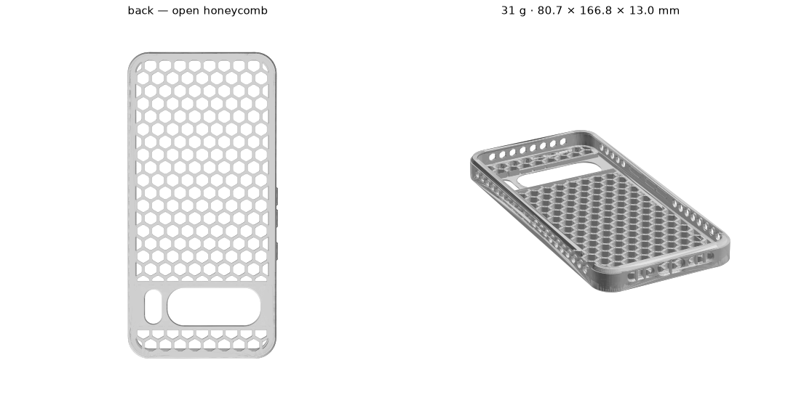

# Pixel 8 Pro case

A printable TPU case for the Pixel 8 Pro — **29 g**, 80.7 × 166.8 × 13.0 mm,
open honeycomb back, no supports.

Built as a parametric [build123d](https://build123d.readthedocs.io) program
rather than a fixed mesh, so the fit and wall thickness can be changed and
rebuilt. Based on
[JamesSF69's Pixel 8 Pro Case (TPU)](https://www.printables.com/model/765202-pixel-8-pro-case-tpu).



## How this came about

The Printables model ships as two STLs, and they turn out to be different
designs, not one plus a bigger charging port. The stock file has proper button
bumps and thin 1.7 mm walls; the other has a usable USB-C opening but is a
thickened copy whose extra 1.27 mm of wall had swallowed the bumps entirely.

So neither file was the good one. Rebuilding both parametrically meant we could
take the button bumps from the first and the working charge hole from the
second, fix a few things that turned up on the way — end walls that were 2 mm
instead of 3, a chamfer applied to only two sides, a flash cutout with an
unprintable 0.2 mm sliver in it — and then make it a lot lighter.

The result is **29 g against the original's 91 g**, and 1.7 mm thinner.

Full measurements, defects and design reasoning are in **[DESIGN.md](DESIGN.md)**.

## Printing

```bash
python case.py            # -> pixel8pro_case_vented.{stl,step}
```

Print **back down, opening upwards**, exactly as exported. No supports.

| | |
|---|---|
| Material | TPU (95A or similar) |
| Layer height | 0.2 mm |
| Nozzle | 0.4 mm |
| Supports | none |
| Infill | irrelevant — the part is all perimeters |

Everything is designed around that one orientation: the honeycomb cells open
upwards, the button bumps have a 45° lower chamfer, and the case sits on a flat
back with no elephant-foot on the very edge.

### Snip out the USB bar

There is a **sacrificial 0.8 mm bar across the middle of the USB-C opening**.
It halves the bridge the printer has to span, and it must be cut out before
use — it sits where the plug goes. Flush cutters or a sharp blade through the
opening; TPU will not snap cleanly.

The bars in the two speaker slots are **permanent** — leave those in. Nothing
passes through a speaker slot, so they are just a grille.

### What you get

| | |
|---|---|
| Weight | ~29 g in TPU (23.9 cm³) |
| Outer | 80.68 × 166.78 × 13.00 mm (81.68 across the button bumps) |
| Side wall | 1.5 mm |
| Back edge | 2.5 mm break, 45° blended into the wall with R1.5 |
| Top edge | no ledge — the wall runs into the rim taper, R1.5 into it and R0.8 over the top |
| Back | open honeycomb, 6.5 mm cells — the phone shows through |
| Cell edges | 0.4 mm × 45° break on the bed side, all 190 cells |
| Over the lenses | 1.0 mm |
| USB-C opening | 15.05 × 7.08 mm |

The open back means **there is no material behind the phone's back glass**. It
is lighter and better for wireless charging, but a drop onto gravel can reach
the glass through a cell. If that bothers you, `pocket_through=False` gives a
closed back with a 1.8 mm skin, at about 55 g — see below, and note it is
untested.

## Changing it

```bash
uv venv --python 3.12 .venv
uv pip install --python .venv/bin/python build123d trimesh numpy rtree matplotlib
```

`Params()` **is** the printed design — bare defaults give exactly the file
above, so anything you build without arguments is the tested configuration:

```python
from dataclasses import replace
from case import Params, export

export(replace(Params(), clr_xy=0.40), "snug")   # tighter fit
```

`case.py` prints the thicknesses that decide whether a build is printable, so
you can see what a change actually did:

```
  outer          80.68 x 166.78 x 13.00 mm
  side wall      1.50 mm
  rim top        2.70 mm
  behind buttons 1.27 mm
  port bore      0.75 mm straight + 0.75 chamfer
  back skin      none (open cells)
```

The knobs most worth touching:

| Parameter | Default | Effect |
|---|---|---|
| `clr_xy` | 0.592 | Fit. Lower is snugger; 0.40 suits TPU |
| `wall` | 1.5 | Side wall — also sets the outer size. 1.5 is the floor |
| `cam_skin` | 1.0 | Material over the lenses. Do not go below 1.0 |
| `hex_pitch` | 8.0 | Honeycomb cell size |
| `pocket_through` | True | False = closed back with a `rib_skin` skin |
| `side_vents` | True | Hexagonal vents through the side walls |
| `usb_bar` | True | Sacrificial bar across the USB opening |

> **Only the default configuration has been printed and tested.** Everything
> else builds and passes the geometric checks, but has not been in a printer or
> on a phone. [DESIGN.md](DESIGN.md) gives the measured limits for each
> parameter — particularly `wall`, `cam_skin` and the button clearance, which
> bind before you would expect.

There is one other preset, `original`, which reproduces the source STL for
`verify.py`. It is the source geometry complete with its defects and is **not
for printing**.

**The STLs are not in this repo**, neither the sources nor the exports.
`case.py` regenerates them exactly. To run `verify.py`, first download
`pixel8CaseChargeHoleBigger.stl` from
[the Printables page](https://www.printables.com/model/765202-pixel-8-pro-case-tpu)
into the repo root.

### With an AI assistant

The repo ships a `.mcp.json` for
[build123d-mcp](https://github.com/pzfreo/build123d-mcp), so an MCP-capable
assistant (Claude Code, Cursor, VS Code, …) opened here can build the model,
render it and measure the geometry rather than editing `case.py` blind. It needs
[uv](https://github.com/astral-sh/uv) on the path; the server is fetched on
first use.

## Credits and licence

Original design: **[JamesSF69](https://www.printables.com/@JamesSF69_537205)** —
[Pixel 8 Pro Case (TPU)](https://www.printables.com/model/765202-pixel-8-pro-case-tpu).
The form, cavity, lip, camera cutouts, port layout and button bumps are theirs.

Licensed **[CC BY-SA 4.0](https://creativecommons.org/licenses/by-sa/4.0/)**,
same as the original — ShareAlike means this cannot be relicensed. If you
redistribute or remix it, keep the credit and the licence. See
[LICENSE](LICENSE) for the full attribution and the list of changes made.
